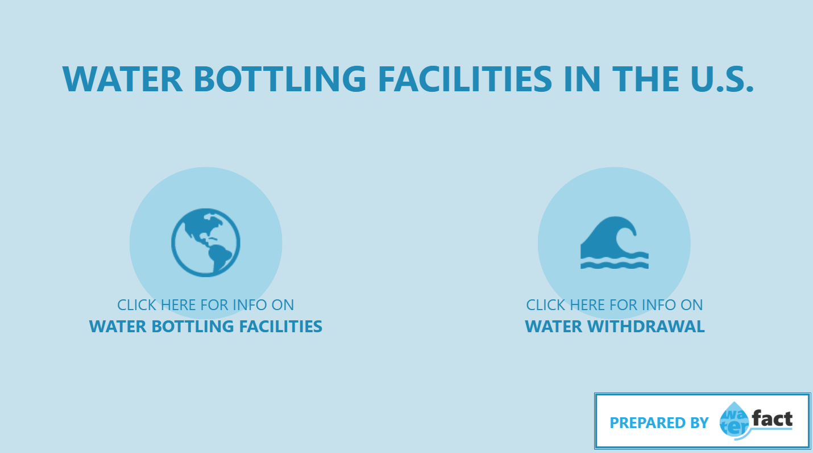

# Water Bottling Facilities in the U.S.

## Table of Contents

- [Overview](#overview)
- [Tools and Technologies](#tools-and-technologies)
- [Exploratory Data Analysis](#exploratory-data-analysis)
- [Data Modelling](#data-modelling)
- [Power BI Report](#power-bi-report)
- [Key Insights](#key-insights)
- [Infographic](#infographic)
- [Data Source](#data-source)
- [References](#references)

### Overview

The following data analysis project investigates an inventory of facilities that bottle water and other drinks in the U.S., and which were active at least until 2023. This work aimed to generate a report that could be consumed as a user-friendly informational resource for U.S. citizens in general.

The topic is particularly relevant, considering water is a fundamental resource, not only for the sustainment and quality of life, but also for many agricultural and industrial activities. Moreover, bottled water production has a considerable environmental impact (Bear, 2024), justifying the need of making information about its production available for the public. 

Finally, an infographic was developed with the main conclusions of this analysis, designed as if it were authored by _Water Fact_, a fictional social media page.

### Tools and Technologies

- Microsoft Excel (Exploratory Data Analysis)
- Power BI (Data Modelling and Data Visualization)
- DAX (Advanced Indicators)
- Adobe Illustrator (Infographic design)

### Exploratory Data Analysis

The available data for this project consists in three .txt datasets and an .xml file, available in [DATA.GOV](https://catalog.data.gov/dataset/inventory-of-water-bottling-facilities-in-the-united-states-2024-and-select-water-use-data), an official website of the U.S. Government. According to the description in the website, the files contain the following information:

- [WBinventory_DataSources.txt](files/WBinventory_DataSources.txt): Information about how the data was acquired for the construction of the other two files.

- [WBinventory_FacilityList.txt](files/WBinventory_FacilityList.txt): Inventory of facilities and associated facility information.

- [WBinventory_WaterUse.txt](files/WBinventory_WaterUse.txt): Water use information for selected facilities.

- [WBinventory_DR.xml](https://www.sciencebase.gov/catalog/file/get/649d8a39d34ef77fcb03f8a6?f=__disk__c7%2F7c%2F86%2Fc77c86c849ca1855d9467b6e8b78b10f4dab7c12&transform=1&allowOpen=true): Metadata with descriptions of the fields and values in each dataset.

As a first step, an initial exploration was performed in Microsoft Excel for each of the files. The complete process with its results can be found in the [initial_exploration.xlsx](files/initial_exploration.xlsx) Excel file on this Github repository.

The steps taken and main results can be summed up as follows:

**General information**:

The three datasets were queried to investigate their number of rows, number of columns, and name of each column. A short random sample of each dataset was taken too.

|Table|Num. of Rows|Num. of Columns|
|---|---|---|
|WBinventory_DataSources|117|6|
|WBinventory_FacilityList|43365|29|
|WBinventory_WaterUse|1870|19|

**Null values**:

Considering the information about null values representations for each column, the number of null values was checked with the `COUNTIF()` formula. Although there is no missing data in terms of water facilities location or annual water withdrawal, many rows have missing values for other fields, which will obviously impose limitations on the final report.

- WBinventory_DataSources:

|Column|% of Null values|
|---|---|
|URL|45%|

- WBinventory_FacilityList:

|Column|% of Null values|
|---|---|
|ALT_NAME|90%|
|NAICS_CODE1|≈0%|
|NAICS_CODE2|99%|
|YEAR_END|≈100%|
|YEAR_ESTABL|64%|
|EMPL_COUNT|31%|
|EMPL_RANGE|9%|
|SALES_YR_AMT|36%|
|SALES_RANGE|15%|
|FAC_SIZE|37%|
|FLEET_SIZE|60%|
|WSA_AGIDF|27%|
|WSA_NAME|27%|

- WBinventory_WaterUse:

|Column|% of Null values|
|---|---|
|Year_of_Data|1%|
|January_Value|25%|
|February_Value|25%|
|March_Value|25%|
|April_Value|25%|
|May_Value|25%|
|June_Value|25%|
|July_Value|25%|
|August_Value|25%|
|September_Value|25%|
|October_Value|25%|
|November_Value|25%|
|December_Value|25%|

**Data types**:

For each column, the `TYPE()` formula was used to check the data type of each row (as interpreted by Excel). Most columns have only number-type or text-type data, although some of them have mixed values. From the latter, the greater part are codes (which can be safely considered as text-type), while some are numeric ranges (which were to be transformed into a more adequate form). There are also some date columns with year values.

**Statistical summary**:

Some general statistical indicators were drawn for numeric columns. In columns with null values, these values were not considered.

- WBinventory_FacilityList:

|Column|Minimum|Maximum|Average|Standard deviation|
|---|---|---|---|---|
|LATITUDE|13.4411|64.9717|37.9146|5.64625|
|LONGITUDE|-165.409|144.836|-97.4105|19.148|
|EMPL_COUNT|1|5000|14.1468|53.5956|
|SALES_YR_AMT|6227|8820M|9.4M|56.4M|

- WBinventory_WaterUse:

|Column|Minimum|Maximum|Average|Standard deviation|
|---|---|---|---|---|
|Annual_MGD|9.9E-07|11.4|0.33438|0.98327|
|January_Value|0|11.9|0.34369|1.05265|
|February_Value|0|11.7|0.33997|0.98273|
|March_Value|0|11|0.32625|0.91448|
|April_Value|0|11.2|0.35566|1.00452|
|May_Value|0|11.7|0.36025|1.00438|
|June_Value|0|12.3|0.39278|1.08912|
|July_Value|0|11.6|0.41294|1.21333|
|August_Value|0|11.9|0.44296|1.38548|
|September_Value|0|12.3|0.44536|1.43257|
|October_Value|0|11.9|0.42468|1.43248|
|November_Value|0|12|0.34564|1.01376|
|December_Value|0|10.6|0.32773|0.95855|

**Cardinality**:

For each dataset, the number of distinct values per column was checked. With this information, a natural key was detected for each table, to uniquely identify each row.

|Table|Natural key|
|---|---|
|WBinventory_DataSources|SOURCE_NAME|
|WBinventory_FacilityList|FAC_ID|
|WBinventory_WaterUse|No single field (concatenation of all fields)|

### Data Modelling

A semantic model was built on Power BI, with a _Water Use_ fact table (based on WBinventory_WaterUse.txt) and a _Facility List_ dimension table (based on WBinventory_FacilityList.txt). There was no use for the WBinventory_DataSources.txt file in this analysis, so this dataset was not considered.

The data from these datasets was first uploaded to Power BI and transformed in the PowerQuery editor. The following transformations were performed upon the _Facility List_ table:

- Several columns were dropped, since they were redundant or irrelevant to this analysis.

- All text columns representing numeric ranges (e.g. SALES_RANGE) were split into pairs, corresponding to their lower and upper bounds.

- Data types were revised and changed when needed.

- All column names were changed into a more user-friendly wording.

Regarding the _Water Use_ table, these transformations were performed:

- The table structure was changed, resulting in one row per combination of year and month. A Date column was added too, with the first day of the given month for each column.

- Data types were revised and changed when needed.

- All column names were changed into a more user-friendly wording.

After uploading and transforming both tables, a single one-to-many relationship was established between them, with “FAC_ID” (now “Facility ID”) working as key, i.e. as the primary key in _Facility List_ and the secondary key in _Water Use_.

In addition, a _Date_ table was created and a one-to-many relationship established with the _Water Use_ table, to correctly filter and apply different time-intelligence functions in the model.

The following image shows the definitive semantic model:

### Power BI Report

A report was built upon the model. The editable version can be found in the [Power BI file](files/water-bottling-facilities-in-the-us.pbix) on this Github repository. There is also a read-only version of the report on [this link](https://app.powerbi.com/view?r=eyJrIjoiNGI5MWYxNjctZTVmZi00MGNjLTkzYjItMjgxNTRiNWU3MDdmIiwidCI6IjM1NDg3YTU2LTFlNGYtNDAzNC04ODNkLWViYjBiMDMxZDNjNCIsImMiOjR9&pageName=201007cede2b36c8f5ce).

The report consists on a front cover and two more pages, with the following elements:

- _Front Cover_:

This page shows the title of the project and buttons to navigate to the rest of the report, with icons representing the different pages. The rest of the pages have a panel on the left side with the same icons, which allows for navigation to other pages or to this cover.

- _Water Bottling Facilities_:

On the top of the page, there is the title and are three text fields, showing the total number of facilities, total sales, and total number of employees.

When hovering over sales and employees data, a message appears indicating the percentage of available data for the calculation (considering not all facilities have sales or employees data). This percentage changes dynamically, considering other filters applied to the page.

On the left side, there is a map visual with the distribution of Facilities, Sales, and Employees over the U.S. territory. One of these three distributions can be selected at a time, by interacting with the three buttons on the left. There are also two buttons to pick a level of granularity, in terms of location (States or Counties). There is also a slicer that allows to filter all the data by a specific State or County.

Finally, the right side shows a pie chart, which represents the distribution of different sources of water for the bottling facilities.

 

- _Water Withdrawal_:

On the top of the page, there is the title and a text field that reads “IMPORTANT INFO”. When hovering over it, a tooltip shows the percentage of facilities for which water withdrawal info is available. This field intends to prevent the user from drawing misled conclusions, as the facilities considered on this page constitute only a very small sample of the total.

The top half of the page shows a bar chart, representing the top 10 facilities with the greatest levels of daily water withdrawal.

The bottom half shows a line chart, representing how the levels of withdrawal evolve over time. The graph aggregates the data for all facilities, but it can also show the evolution of a particular facility by clicking its corresponding bar on the bar chart. There are also two buttons to choose a level of granularity for the data: yearly or monthly.

### Key Insights

This report would allow U.S. citizens to draw some conclusions about water bottling across the country and its sources. In particular, the following could be mentioned:

- There are at least 43.000 water bottling facilities in the U.S., which employ roughly 481.000 people, and have yearly sales over 282 billion dollars.

- The most frequent water source for all the facilities considered is **Public Supply**, being the source of 71.41% of the facilities. The second most frequent source is **Well**, with a 21.54%.

- **California** is the state with most facilities, total sales, and total employees. Inside California, **Los Angeles** is the county with most facilities, sales, and employees.

- As in the general case, the most frequent water source in Los Angeles is **Public Supply**, with a 97.09%.

- The counties in California with most facilities sourced by **Well** are **Sonoma** (51.05%) and **Napa** (50.69%). Regarding that state, these counties are second to Los Angeles in number of facilities, and rank amongst the top counties in terms of sales and employees.

- The state with most facilities whose source is **Undetermined** is **Hawaii**, with a 90.22%.

- Regarding water withdrawal, **2004** was the year with the highest daily average, with **0.89 million gallons**. During that year, the month with the greatest withdrawal average was **October**, with **1.18 million gallons**.

- The facility with the greatest level of water withdrawal was **Mgpi Processing, Inc.**, with a daily average of **10.4 million gallons**. This facility reached its highest daily average in June 2017, with 12.30 million gallons. 

### Infographic

As it was previously stated, an infographic was developed with the main conclusions of this analysis. It was designed as if it were authored by _Water Fact_, a fictional social media page which generally posts interesting facts about water as a critical resource for human consumption and most agricultural and industrial activities.

This infographic presents some key figures about water facilities and sources. It is intended for its publication in social media (e.g. Instagram), with a link to the full Power BI report.

### Data Source

U.S. Department of the Interior (2023). Inventory of water bottling facilities in the United States, 2023, and select water-use data, 1955-2022. [https://catalog.data.gov/dataset/inventory-of-water-bottling-facilities-in-the-united-states-2024-and-select-water-use-data]( https://catalog.data.gov/dataset/inventory-of-water-bottling-facilities-in-the-united-states-2024-and-select-water-use-data), May 12th 2025.

### References

Bear S. (2024, October 14). Bottled Water: Myths vs. Facts. Tap Score. [https://mytapscore.com/blogs/tips-for-taps/bottled-water-myths-vs-facts]( https://mytapscore.com/blogs/tips-for-taps/bottled-water-myths-vs-facts), May 12th 2025.
